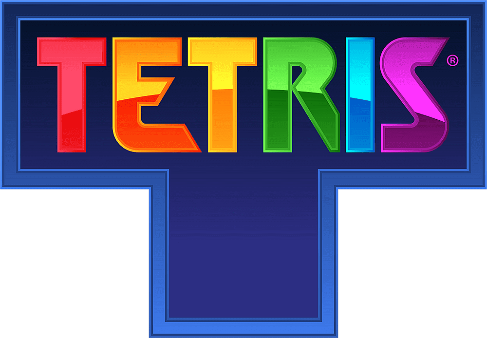

 
# Classical Game Tetris in Python Programming Language Using Pygame
### Description
This game was developed using Python's frequintly used library PyGame. The algorith of this game is based on the position of a block which means block won't move on the background of a game. However, when a certain block reaches to have a collision program will save its position there as numbers. Field for this game uses list of lists to describe in the background, but for the front of the game it uses a rectangular shape to draw the field. Field is 20x10 where 20 is the height and 10 is the width of the game which means there are 20 lists in a list and 10 numbers in each list. For collisions, It uses the saved blocks and the  size of the field to check. First it checks if the cell before it is free, and if it is indeed free, then the block will move. To move the blocks you can do:
<table>
    <thead>
        <tr width="300px" height="100px">
            <th colspan="2">In the Game</th>
        </tr>
        <tr>
            <tr>
                <th width="300px" height="100px">Buttons</th>
                <th width="300px" height="100px">Task</th>
            </tr>
        </tr>
    </thead>
    <tr>
        <td width="300px" height="100px">v (Down Arrow)</td>
        <td width="300px" height="100px">Block drops faster</td>
    </tr>
    <tr>
        <td width="300px" height="100px">> (Left Arrow)</td>
        <td width="300px" height="100px">Block moves to the left</td>
    </tr>
    <tr>
        <td width="300px" height="100px">< (Right Arrow)</td>
        <td width="300px" height="100px">Block moves to the right</td>
    </tr>
    <tr>
        <td width="300px" height="100px">A</td>
        <td width="300px" height="100px">Block rotates anti-clockwise</td>
    </tr>
    <tr>
        <td width="300px" height="100px">D</td>
        <td width="300px" height="100px">Block rotates clockwise</td>
    </tr>
    <thead>
        <tr width="300px" height="100px">
            <th colspan="2">In the Settings</th>
        </tr>
    </thead>
     <tr>
        <td width="300px" height="100px">> (Left Arrow)</td>
        <td width="300px" height="100px">Volume Up</td>
    </tr>
    <tr>
        <td width="300px" height="100px">< (Right Arrow)</td>
        <td width="300px" height="100px">Volume Down</td>
    </tr>
    <tr>
        <td width="300px" height="100px">M</td>
        <td width="300px" height="100px">Mute</td>
    </tr>
    <tr>
        <td width="300px" height="100px">^ (Up Arrow)</td>
        <td width="300px" height="100px">Up</td>
    </tr>
    <tr>
        <td width="300px" height="100px">v (Down Arrow)</td>
        <td width="300px" height="100px">Down</td>
    </tr>
    <thead>
        <tr width="300px" height="100px">
            <th colspan="2">In the Main Menu</th>
        </tr>
    </thead>
     <tr>
        <td width="300px" height="100px">^ (Up Arrow)</td>
        <td width="300px" height="100px">Up</td>
    </tr>
    <tr>
        <td width="300px" height="100px">v (Down Arrow)</td>
        <td width="300px" height="100px">Down</td>
    </tr>
    <tr>
        <td width="300px" height="100px">Return</td>
        <td width="300px" height="100px">Enter</td>
    </tr>
</table>
<h2>This version of game was developed by Usmonjon Dusmatov, so do not clone this for your own use, and for the folder <code>materials/</code> , those materials doesn't have rights to copy. I just downloaded them from some website.</h2>